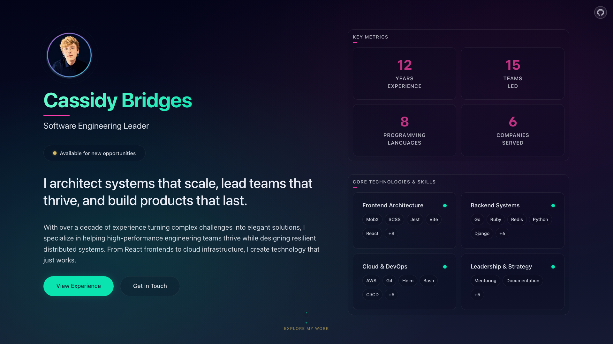
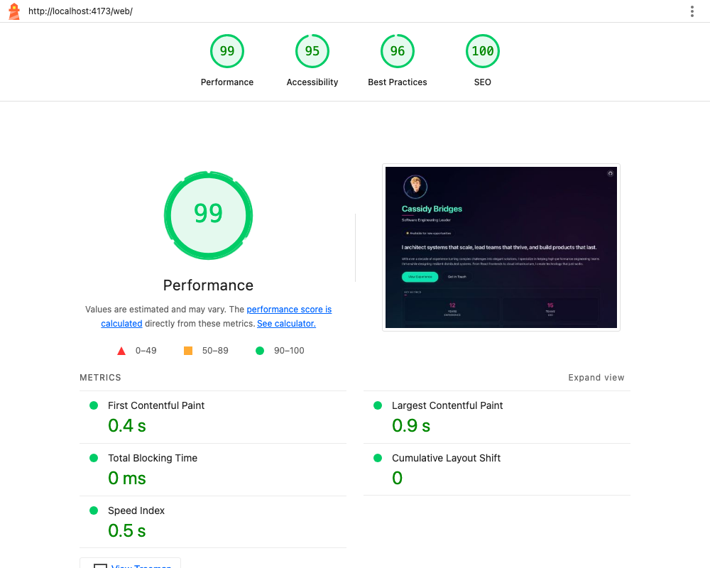
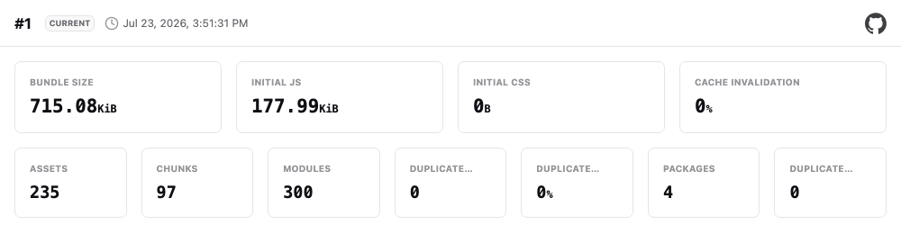

# Personal Website

<p align="center">
  <a href="https://off-by-some.github.io/web/">
    
  </a>
</p>

<p align="center">
  <a href="https://off-by-some.github.io/web/">
    
  </a>
  <a href="https://off-by-some.github.io/web/storybook/">
    
  </a>
  <a href="docs/lighthouse-report.png">
    
  </a>
  <a href="https://kit.svelte.dev/">
    
  </a>
</p>

<p align="center"><strong>Software engineering portfolio and component system.</strong></p>

This repository contains my personal website and the component system behind it. It is intentionally small enough to inspect quickly, but built with the same concerns I would bring to a production product surface: semantic design tokens, isolated components, accessible interactions, responsive image handling, critical CSS, Storybook documentation, and reproducible performance checks.

The production build is static, deploys to GitHub Pages, and includes a built Storybook at `/web/storybook/` so the component library can be reviewed without cloning the repo.

## Links

| Artifact          | URL                                                          |
| ----------------- | ------------------------------------------------------------ |
| Production site   | https://off-by-some.github.io/web/                           |
| Component library | https://off-by-some.github.io/web/storybook/                 |
| Lighthouse report | [docs/lighthouse-report.png](docs/lighthouse-report.png)     |
| Bundle report     | [docs/bundle-stats-report.png](docs/bundle-stats-report.png) |

## Why This Exists

Most portfolio sites solve only the content problem: put a resume, a few links, and a contact form online. I wanted this one to solve a broader product problem: make a small personal site feel as considered as a production interface.

That means the polish has to be systematic. Cards should share one interaction language. Buttons should not drift across sections. Inputs and dropdowns should carry their own accessibility and state behavior. Images should load through one pipeline. Design decisions should flow from tokens instead of one-off CSS.

The repository is meant to show both parts: the live result and the engineering choices underneath it.

## What To Look For

| Area                   | What it demonstrates                                                                                          |
| ---------------------- | ------------------------------------------------------------------------------------------------------------- |
| Design systems         | Semantic SCSS tokens compile into CSS custom properties used across every component.                          |
| Component architecture | Primitives and site components are organized like a small internal UI library.                                |
| Accessibility          | Keyboard behavior, focus states, field labels, error text, and semantic fallbacks live inside components.     |
| Performance            | Static generation, responsive images, critical CSS, minification, and Lighthouse CI are part of the workflow. |
| Documentation          | Storybook mirrors the component folder taxonomy and ships with the GitHub Pages artifact.                     |

## Design System

The design system is here because even a compact site benefits from product-level consistency. Shared tokens and primitives make the interface easier to extend, easier to theme, and easier to keep visually coherent as new sections are added.

My take is that design-system work is less about making everything look identical and more about making decisions reusable. The system should protect consistency while still giving components enough room to express their role.

The visual language starts in `src/styles/foundations/_tokens.scss`. Components do not hardcode brand colors directly; they consume semantic CSS custom properties:

```scss
color: var(--token-text-primary);
border: var(--token-border-default-small);
box-shadow: var(--token-shadow-elevated);
```

The token engine in `src/styles/lib/_themes.scss` supports semantic references, alpha transforms, generated color scales, and failure checks for invalid or circular references. A token can derive from another token by intent:

```scss
interactive: (
  color: (
    teal: 100,
  ),
  hover: (
    teal: 50,
  ),
  glow: themes.reference('interactive.color', $alpha: 20%),
  shadow: themes.reference('interactive.color', $alpha: 30%)
);
```

That lets the theme behave more like a production design system than a palette file. If the interactive color changes, hover borders, focus rings, glows, shadows, and interactive text can follow without searching through component styles.

Gold is used sparingly as the attention color, teal as the primary interactive signal, and magenta as emphasis. The point is not only visual style; it is a repeated cue system that helps users understand what is interactive, what is important, and what belongs together.

## Component Library

The component tree mirrors the Storybook sidebar:

```text
src/lib/components/
  primitives/
    actions/
    behavior/
    forms/
    layout/
    media/
    status/
    surfaces/
    typography/

  site/
    contact/
    hero/
    metrics/
    section-headings/
    skills/
    status/
    timeline/
```

Primitives are flexible building blocks: `Button`, `Card`, `Field`, `Input`, `Dropdown`, `Image`, `Section`, `Header`, `IconTile`, and `ToneDot`.

Site components compose those primitives into portfolio-specific units: `HeroProfile`, `HeroPanel`, `SkillCard`, `ExperienceCard`, `ContactForm`, `AvailabilityStatus`, and related section pieces.

This keeps the larger page sections mostly orchestration. They provide content and layout intent, while the components own their CSS, interaction behavior, and visual consistency.

## Accessibility and Interaction

Once styling decisions are centralized, interaction behavior can follow the same model. The repository keeps common behavior in primitives rather than rediscovering it inside each section.

For example, `Card` can stay a plain container, render as another element, or become keyboard-operable when it has click behavior:

```ts
const pressable = $derived(pressableAttrs({ as, onclick }));
```

That helper preserves native anchors and buttons, while giving custom clickable surfaces focusability and Enter/Space activation only when needed.

Forms follow the same principle. `Field`, `Input`, and `Dropdown` keep labels, required markers, help text, error text, counters, focus states, and keyboard movement attached to the component that owns the behavior. A section using the contact form should not need to know how a dropdown handles Home/End or how an error message is associated with an input.

## Performance Pipeline

The build pipeline keeps the same philosophy: production concerns should be repeatable, not hand-tuned at the end.

The site is pre-rendered with SvelteKit for static GitHub Pages hosting, images are processed through `@sveltejs/enhanced-img` and Sharp, and a generated foundation stylesheet is inlined as critical CSS so theme tokens and resets are available at first paint.



Lighthouse CI is part of the normal project workflow rather than a manual final check. The report gives a quick read on the user-facing result: performance, accessibility, best practices, SEO, and the core page metrics behind the score.



Bundle stats cover the other side of the same question: what shipped to make that experience possible. The generated report makes bundle size, initial JavaScript, asset count, chunk count, duplicate modules, and cache invalidation visible enough to catch regressions during routine work.

## Stack

| Layer       | Tools                                            |
| ----------- | ------------------------------------------------ |
| Application | SvelteKit, Svelte 5, TypeScript                  |
| Styling     | SCSS, CSS custom properties, custom token engine |
| Components  | Storybook, Svelte CSF                            |
| Images      | Sharp, `@sveltejs/enhanced-img`                  |
| Quality     | ESLint, Prettier, Svelte Check, Lighthouse CI    |
| Deployment  | Static GitHub Pages artifact via `gh-pages`      |

## Quick Start

```bash
npm install
npm run dev
```

Open [localhost:5173](http://localhost:5173).

Run the component library:

```bash
npm run storybook
```

Validate the project:

```bash
npm run check
npm run build
```

## Useful Commands

```bash
npm run dev                   # local development server
npm run storybook             # local component library
npm run check                 # Svelte + TypeScript validation
npm run build                 # production static build
npm run build-storybook:pages # build Storybook into build/storybook
npm run screenshot:all        # Lighthouse + report screenshots
npm run deploy                # publish site and Storybook to GitHub Pages
```
