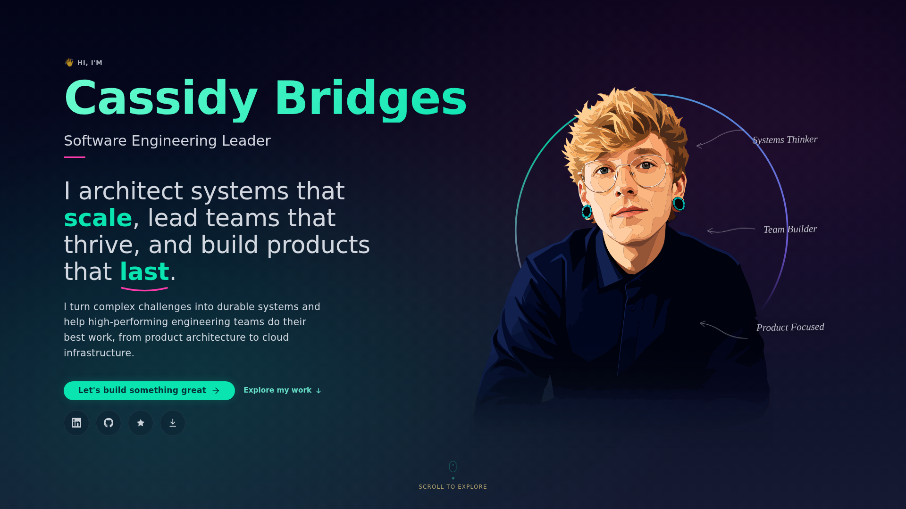
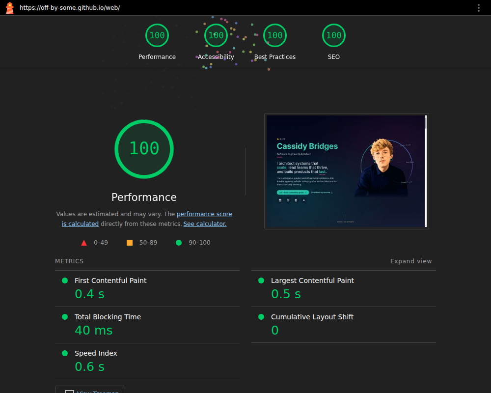
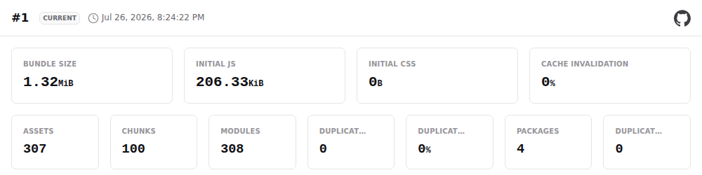
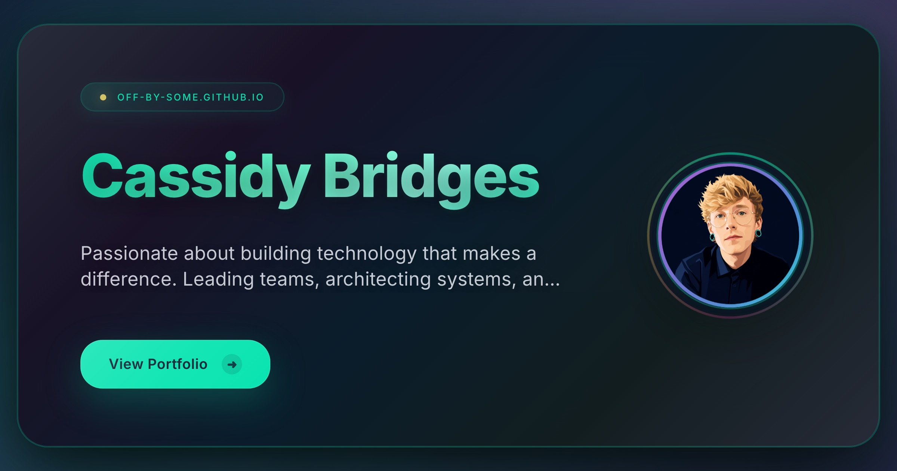

# Personal Website

<p align="center">
  <a href="https://off-by-some.github.io/web/">
    
  </a>
</p>

<p align="center">
  <a href="https://off-by-some.github.io/web/">
    
  </a>
  <a href="https://off-by-some.github.io/web/storybook/">
    
  </a>
  <a href="docs/lighthouse-report.png">
    
  </a>
  <a href="https://kit.svelte.dev/">
    
  </a>
</p>

<p align="center"><strong>Software engineering portfolio and component system.</strong></p>

Web engineers sometimes joke that beautiful websites are large and ugly websites are small. Once you start caring about accessibility, responsive imagery, design systems, performance budgets, and polished interactions, bytes have a way of accumulating. This repository is my answer to that bit of engineering folklore.

It contains my personal website and the component system that power it. While intentionally small enough to inspect in an afternoon, it's built with the same standards I bring to a production product surface: semantic design tokens, isolated components, accessible interactions, responsive image handling, critical CSS, Storybook documentation, and reproducible performance checks.

The end result is a static production build with a near-perfect Lighthouse score, deployed to GitHub Pages and accompanied by a [pre-built Storybook](https://off-by-some.github.io/web/storybook/), making the entire component library inspectable without cloning the repository. The site visually behaves like an elaborate application, but loads like a small static document.

## Links

| Artifact          | URL                                                          |
| ----------------- | ------------------------------------------------------------ |
| Production site   | https://off-by-some.github.io/web/                           |
| Component library | https://off-by-some.github.io/web/storybook/                 |
| Lighthouse report | [docs/lighthouse-report.png](docs/lighthouse-report.png)     |
| Bundle report     | [docs/bundle-stats-report.png](docs/bundle-stats-report.png) |

## Why This Exists

Many portfolio sites solve only the content problem: put a resume, a few links, and a contact form online. I wanted this one to solve a broader product problem: make a small personal site look and feel as considered as a production interface.

This meant that the polish had to be systematic. Cards should share one interaction language. Buttons should not drift across sections. Inputs and dropdowns should carry their own accessibility and state behavior. Images should load through one pipeline. Design decisions should flow from tokens instead of one-off CSS.

The repository is meant to show both parts: the live result and the engineering choices underneath it.

## What To Look For

| Area                   | What it demonstrates                                                                                          |
| ---------------------- | ------------------------------------------------------------------------------------------------------------- |
| Design systems         | Semantic SCSS tokens compile into CSS custom properties used across every component.                          |
| Component architecture | Primitives and site components are organized like a small internal UI library.                                |
| Accessibility          | Keyboard behavior, focus states, field labels, error text, and semantic fallbacks live inside components.     |
| Performance            | Static generation, responsive images, critical CSS, minification, and Lighthouse CI are part of the workflow. |
| Documentation          | Storybook mirrors the component folder taxonomy and ships with the GitHub Pages artifact.                     |

## Design System

The design system exists simply because even a compact site benefits from product-level consistency. Shared tokens and primitives make the interface easier to extend, easier to theme, and easier to keep visually coherent as new sections are added. Modifying styles and prototyping themses consistently in this application only requires modifying a single page.

My take is that design-system work is less about making everything look identical and more about making decisions reusable. The system should protect consistency while still giving components enough room to express their role.

The visual language is defined within `src/styles/foundations/_tokens.scss`. Components do not hardcode brand colors directly; they consume semantic CSS custom properties:

```scss
color: var(--token-text-primary);
border: var(--token-border-default-small);
box-shadow: var(--token-shadow-elevated);
```

The token engine in `src/styles/lib/_themes.scss` supports semantic references, alpha transforms, generated color scales, and failure checks for invalid or circular references. A token can derive from another token by intent:

```scss
interactive: (
  color: (
    teal: 100,
  ),
  hover: (
    teal: 50,
  ),
  glow: themes.reference('interactive.color', $alpha: 20%),
  shadow: themes.reference('interactive.color', $alpha: 30%)
);
```

That lets the theme behave more like a production design system than a palette file. If the interactive color changes, hover borders, focus rings, glows, shadows, and interactive text can follow without searching through component styles.

Gold is used sparingly as the attention color, teal as the primary interactive signal, and magenta as emphasis. The point is not only visual style; it is a repeated cue system that helps users understand what is interactive, what is important, and what belongs together.

## Component Library

The component tree mirrors the Storybook sidebar:

```text
src/lib/components/
  primitives/
    actions/
    behavior/
    forms/
    layout/
    media/
    status/
    surfaces/
    typography/

  site/
    contact/
    hero/
    metrics/
    section-headings/
    skills/
    status/
    timeline/
```

Primitives are flexible building blocks: `Button`, `Card`, `Field`, `Input`, `Dropdown`, `Image`, `Section`, `Header`, `IconTile`, and `ToneDot`.

Site components compose those primitives into portfolio-specific units: `HeroProfile`, `HeroPanel`, `SkillCard`, `ExperienceCard`, `ContactForm`, `AvailabilityStatus`, and related section pieces.

This keeps the larger page sections mostly orchestration. They provide content and layout intent, while the components own their CSS, interaction behavior, and visual consistency.

## Accessibility and Interaction

Once styling decisions are centralized, interaction behavior can follow the same model. The repository keeps common behavior in primitives rather than rediscovering it inside each section.

For example, `Card` can stay a plain container, render as another element, or become keyboard-operable when it has click behavior:

```ts
const pressable = $derived(pressableAttrs({ as, onclick }));
```

That helper preserves native anchors and buttons, while giving custom clickable surfaces focusability and Enter/Space activation only when needed.

Forms follow the same principle. `Field`, `Input`, and `Dropdown` keep labels, required markers, help text, error text, counters, focus states, and keyboard movement attached to the component that owns the behavior. A section using the contact form should not need to know how a dropdown handles Home/End or how an error message is associated with an input.

## Performance Pipeline

The build pipeline keeps the same philosophy: production concerns should be repeatable, rather than hand-tuned at the end. The site is pre-rendered with SvelteKit for static GitHub Pages hosting, images are processed through `@sveltejs/enhanced-img` and Sharp, and a generated foundation stylesheet is inlined as critical CSS so theme tokens and resets are available at first paint.

These next two images are up-to-date with the currently deployed version. These aren't hand-picked screenshots, they're generated and pushed after every successful deployment by [GitHub Actions](https://github.com/off-by-some/web/blob/main/.github/workflows/post-deploy-screenshots.yml#L21).



As a result, Lighthouse CI is part of the normal project workflow rather than a manual final check. The report gives a quick read on the user-facing result: performance, accessibility, best practices, SEO, and the core page metrics behind the score.



Bundle stats cover the other side of the same question: what shipped to make that experience possible. The generated report makes bundle size, initial JavaScript, asset count, chunk count, duplicate modules, and cache invalidation visible enough to catch regressions during routine work.

While the total bundle size may look large, **Initial JS** is the metric that matters most for startup performance. Many of the assets included in the build, particularly responsive image variants, **are never downloaded by the user**. They're generated ahead of time so the browser can automatically choose the most appropriate version for the current device and viewport, fetching only what's needed.

## SEO and Unfurling Pipeline

The site also treats link previews as a build artifact. Social cards are often the first rendered version of a project that someone sees, so the preview image should be generated from the same source assets as the page rather than exported by hand.

`npm run setup:static` renders the Open Graph template with Puppeteer, injects the current headshot, exports a compressed `og-about.jpg`, and copies that generated image into `docs/` for review:



The deployed page references the production copy at `/web/og/og-about.jpg`, while this README keeps the docs copy visible so changes to the social preview are reviewed with the same discipline as Lighthouse and bundle stats. The post-deployment workflow commits all four visual artifacts together: website preview, Lighthouse report, bundle report, and unfurl image.

## Stack

| Layer       | Tools                                            |
| ----------- | ------------------------------------------------ |
| Application | SvelteKit, Svelte 5, TypeScript                  |
| Styling     | SCSS, CSS custom properties, custom token engine |
| Components  | Storybook, Svelte CSF                            |
| Images      | Sharp, `@sveltejs/enhanced-img`                  |
| Quality     | ESLint, Prettier, Svelte Check, Lighthouse CI    |
| Deployment  | Static GitHub Pages artifact via `gh-pages`      |

## Quick Start

```bash
npm install
npm run dev
```

Open [localhost:5173](http://localhost:5173).

Run the component library:

```bash
npm run storybook
```

Validate the project:

```bash
npm run verify
npm run build
```

## Useful Commands

The top-level commands are meant to be self-contained. Prefer these for day-to-day work:

```bash
npm run dev            # prepares static assets, then starts the local site
npm run storybook      # starts the local component library
npm run verify         # runs Svelte, TypeScript, ESLint, and Prettier checks
npm run build          # cleans, prepares assets, builds the site, builds Storybook, finalizes Pages output
npm run lighthouse     # runs a fresh production build, then audits it with Lighthouse CI
npm run screenshot:all # runs a fresh production build, then captures Lighthouse, report, and site screenshots

# Pass --url=<value> (or set TARGET_URL) to audit/screenshot a remote deployment instead,
# e.g. the live GitHub Pages site, skipping the local build and preview server:
npm run lighthouse -- --url=https://off-by-some.github.io/web/
npm run screenshot:all -- --url=https://off-by-some.github.io/web/
npm run deploy         # runs a fresh production build, then publishes build/ to GitHub Pages
```

The lower-level commands are useful when you already know the prerequisite step has happened:

```bash
npm run check                 # runs Svelte + TypeScript validation only
npm run check:watch           # runs Svelte + TypeScript validation in watch mode
npm run lint                  # runs ESLint and Prettier in check mode
npm run lint:fix              # applies ESLint auto-fixes only
npm run format                # applies Prettier formatting across the repository
npm run fix                   # applies ESLint auto-fixes, then Prettier formatting
npm run precommit             # runs staged auto-fixes through lint-staged, then type checks the project
npm run setup:static          # copies public assets and regenerates OG, favicon, and critical CSS files
npm run build:app             # builds only the SvelteKit app; expects static assets to already exist
npm run build:storybook:pages # builds Storybook into build/storybook for GitHub Pages
npm run build:finalize        # writes 404.html, inlines critical CSS, and adds .nojekyll; expects build/index.html
npm run lighthouse:run        # audits the existing build; run npm run build first (or set TARGET_URL to audit a remote URL)
npm run screenshot:website    # screenshots the existing build through npm run preview; run npm run build first (or pass --url=<value> to screenshot a remote URL)
npm run screenshot:reports    # screenshots existing .bundle-stats and metrics/lhci reports
```

The Git pre-commit hook runs `npm run precommit`. It intentionally avoids `npm run build` so commits stay quick; use `npm run verify` or `npm run build` when you want the full repository checks before pushing or deploying.
