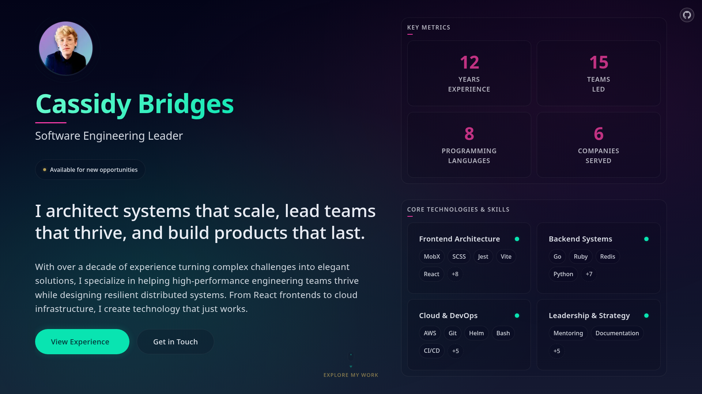

# Personal Website

[](https://off-by-some.github.io/web/)
[](https://kit.svelte.dev/)
[]()



A personal site built as an exploration of modern web development—part portfolio, part engineering playground. Crafted with Svelte 5 and powered by a thoughtfully designed SCSS architecture.

## Table of Contents

- [Quick Start](#quick-start)
- [Tech Highlights](#tech-highlights)
- [Performance Results](#performance-results)
- [Architecture](#architecture)
- [Development Workflow](#development-workflow)
- [Build Pipeline](#build-pipeline)

## Quick Start

```bash
# Install dependencies
npm install

# Start development server
npm run dev

# > Note: Starting the dev server will automatically regenerate the `static/` directory (images, OG image, and token CSS). No manual edits to `static/` are needed.
```

Visit `http://localhost:5173` to see your changes in real-time.

## Tech Highlights

| Feature                | Tech Used                   | Why It's Interesting                            |
| ---------------------- | --------------------------- | ----------------------------------------------- |
| **Critical CSS**       | SCSS + Vite                 | Eliminates FOUC, immediate styling              |
| **Color Science**      | OKLCH + Sass Maps           | Perceptually uniform, auto-propagating palettes |
| **Bundle Analysis**    | Rollup + File Size Plugin   | Real-time bundle optimization feedback          |
| **Pre-commit Quality** | Husky + ESLint + Prettier   | Enforces code standards automatically           |
| **Security Headers**   | CSP + Trusted Types + COOP  | XSS, clickjacking, and cross-origin protection  |
| **OG Generation**      | Puppeteer + Headless Chrome | Automated social media previews                 |
| **Design Tokens**      | Semantic theming system     | Single source of truth for visual consistency   |

## Performance Results

Latest build metrics from production bundle:

```
📦 Bundle Sizes (Gzipped)
├── Main App Bundle: 19.25 KB
├── Vendor Chunk: 13.38 KB
├── CSS Bundle: 16.57 KB
└── Total Initial Load: ~49 KB

```

## Architecture

### SCSS Design System

The project features a sophisticated theming architecture with automatic color propagation:

<details>
<summary>View theme system example</summary>

```scss
$dark-mode-tokens: (
  brand: (
    teal: #1de9b6,
    // Single source of truth
  ),

  interactive: (
    color: (
      teal: 100,
    ),
    // References teal at step 100
    hover: (
        teal: 50,
      ),
    // Auto-generates lighter shade
    focus: (
        teal: 0,
      ),
    // Auto-generates lightest shade
  ),

  text: (
    brand: themes.reference('interactive.color'),
    hovered: themes.reference('interactive.hover'),
  ),
);
```

**Color Propagation**: Changing `teal: #1de9b6` to any color instantly updates all 21 generated color steps and every reference throughout the app, maintaining mathematically verified color relationships.

</details>

**Key architectural decisions:**

- **`styles/foundations/`** - Critical CSS loaded in `app.html` to prevent FOUC
- **`styles/lib/`** - OKLCH color system with perceptual uniformity
- **Semantic tokens** - Theme-agnostic naming (`interactive.hover` vs `teal-300`)
- **Reference system** - Dynamic color resolution with alpha manipulation

### Build Architecture

- **Pre-build**: Lint validation → OG image generation → Critical CSS compilation
- **Build**: Bundle analysis → Code splitting → Asset optimization
- **Post-build**: SPA fallback setup → GitHub Pages preparation

## Development Workflow

### Daily Commands

```bash
npm run dev          # Start development server with HMR
npm run fix          # Auto-fix linting issues and format code
npm run lint         # Check code quality and formatting
npm run check        # Run Svelte type checking
npm run clean        # Remove build/ and static/ (static will be regenerated automatically)
```

### Build & Deploy

```bash
npm run build        # Cleans then regenerates static/ and builds the app
npm run preview      # Preview production build locally
npm run deploy       # Deploy to GitHub Pages
```

### Component Development

```bash
npm run storybook    # Launch Storybook for component development
```

## Build Pipeline

The build process orchestrates multiple systems for production optimization:

### Pre-build Phase (`prebuild`)

1. **Clean** - Remove `build/` and `static/`
2. **Code Quality** - ESLint validation ensures code standards
3. **Static Assets Setup** - Images, OG image, and critical CSS regenerated into `static/`

### Build Phase

- **Bundle Analysis** - File size reporting with gzip and Brotli metrics
- **Code Splitting** - Vendor chunks separated for optimal caching
- **Asset Optimization** - Images converted to WebP, CSS minified

### Post-build Phase

- **SPA fallback** - `404.html` created for client-side routing
- **GitHub Pages** - `.nojekyll` created to allow assets starting with `_`

## Self-healing Static Assets

The `static/` directory is fully generated and safe to delete. It is rebuilt automatically on both `npm run dev` and `npm run build`.

- **Source of truth**: Place raw assets in `images/` (PNGs, JPGs, SVGs, etc.)
- **Generated outputs**: Optimized assets are written to `static/`

### How generation works

- **Images → WebP/SVG copy**: `npm run generate:images`
  - Converts images from `images/` to WebP in `static/` (preserves directory structure)
  - Copies SVGs as-is
  - Requires ImageMagick
    - Arch/Manjaro: `sudo pacman -S imagemagick`
- **Open Graph**: `npm run generate:og` writes `static/og/og-about.png`
- **Token CSS**: `npm run css:foundations` compiles `src/styles/foundations/index.scss` to `static/index.css`

### Automation hooks

- **`predev`**: `npm run setup:static` (runs before `vite dev`)
- **`prebuild`**: `npm run clean && npm run fix && npm run lint && npm run setup:static`
- **`postbuild`**: Creates `build/404.html` and `build/.nojekyll`

### Script reference

```bash
npm run clean           # Delete static/ and build/
npm run generate:images # Build static assets from images/
npm run generate:og     # Generate OG images into static/og/
npm run css:foundations # Compile tokens/reset to static/index.css
npm run setup:static    # Runs all of the above generation tasks
```

### Open Graph Pipeline

Automated social media preview generation using Puppeteer:

```bash
npm run generate:og  # Generate OG images via headless Chrome
```

The pipeline renders HTML templates, converts images to base64 for reliable loading, and captures high-DPI screenshots at social media dimensions.

**Technology Stack**: SvelteKit • TypeScript • SCSS • Vite • ESLint • Prettier • Puppeteer • GitHub Pages
