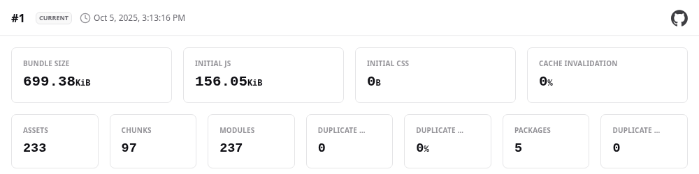

# 🌐 Personal Website

[](https://off-by-some.github.io/web/)
[](https://kit.svelte.dev/)
[]()


---

## 🚀 Quick Start

```bash
npm install && npm run dev
```

**→** Open [localhost:5173](http://localhost:5173)

---

## What This Is

My personal website and a place to experiment with web technologies. I wanted to see if I could build something that feels modern and polished while keeping the actual code lightweight and maintainable. This is my first svelte project, so i really wanted to get familiar with the ecosystem 🌟

It's also become a testing ground for ideas around design systems, build optimization, and developer experience—the kind of stuff that's easier to explore in a personal project than at work.

---

## 📊 Current Performance

### Lighthouse Scores


These scores are captured automatically after each build against the actual deployed site. While perfect scores don't guarantee a great user experience, they do indicate the technical foundation is solid—no render blocking, minimal layout shifts, good semantic markup.

**Reproduce these results:**

```bash
npm run build && npm run lighthouse
```

---

### Bundle Composition

[](docs/bundle-stats-report.png)

**The breakdown:** While the total download includes a substantial amount of content, most of that is images—photos, graphics, and generated social previews. The critical JavaScript that actually runs the site and affects initial load time is much smaller, consisting of just the essential SvelteKit runtime and application code.

**Why this matters:** Images load progressively and are cached aggressively by browsers. The critical rendering path (HTML, CSS, essential JS) loads first and determines how quickly users see content. That's where aggressive optimization pays off most.

**Reproduce these results:**

```bash
npm run build
# Reports generated at .bundle-stats/bundle-stats.html
```

---

## 🎨 Design System

### Color Token Architecture

Rather than hardcoding colors throughout the CSS, everything references a central token system. Here's how it works:

```scss
$theme: (
  brand: (
    teal: #1de9b6,
    magenta: #ff3cac,
    gold: #ffd966,
    // ... base palette
  ),

  interactive: (
    color: (
      teal: 100,
      // Reference step 100 of teal scale
    ),
    hover: (
      teal: 50,
      // Different step for hover states
    ),
    glow: themes.reference('interactive.color', $alpha: 20%),
    shadow: themes.reference('interactive.color', $alpha: 30%),
  ),

  text: (
    primary: themes.reference('text.color', $alpha: 95%),
    secondary: themes.reference('text.color', $alpha: 85%),
    brand: themes.reference('interactive.color'),
    // ... semantic text colors
  ),
);

// Compiles to CSS custom properties:
// --interactive-color: rgb(104, 251, 205);
// --interactive-glow: rgba(104, 251, 205, 0.2);
// --text-brand: rgb(104, 251, 205);
```

The `themes.reference()` function handles color space conversions (using OKLCH for perceptual uniformity), generates color scales automatically, and manages alpha transparency. Change the base teal value and dozens of derived colors update while maintaining their intended relationships.

### Typography & Spacing

Fluid scales that respond to viewport size without hard breakpoints:

```scss
font: (
  size: (
    'base': clamp(1rem, 1rem + 0.25vw, 1.125rem),
    '2xl': clamp(1.5rem, 1.5rem + 0.6vw, 1.875rem),
    '4xl': clamp(2.25rem, 2.25rem + 1.2vw, 3.5rem),
  ),
),
space: (
  fluid: (
    'md': clamp(0.75rem, 0.75rem + 0.2vw, 1rem),
    'xl': clamp(1.5rem, 1.5rem + 0.4vw, 2.25rem),
  ),
),
```

Typography and spacing scales smoothly from mobile to desktop without the jarring jumps that happen with traditional breakpoint-based responsive design.

---

## ⚙️ Build Pipeline

### Asset Optimization

**Images:** All images get processed through `@sveltejs/enhanced-img` and `sharp`, which handles format conversion (WebP where supported), responsive sizing, and lazy loading automatically.

**CSS:** Compiled from SCSS with design token expansion, then minified with `cssnano`. Critical CSS inlines for immediate rendering.

**JavaScript:** Tree-shaken and minified with Terser. Console statements stripped in production. Vendor code split for better caching.

### Quality Automation

Pre-commit hooks catch issues before they enter the repository:

```bash
# Runs on every git commit
→ ESLint (code quality, potential bugs)
→ Prettier (consistent formatting)
→ TypeScript (type safety)
→ Svelte Check (component validation)
```

Build-time validation ensures deployments are solid:

```bash
# During npm run build
→ Bundle analysis (track size changes)
→ Lighthouse CI (performance regression detection)
→ Asset optimization (WebP conversion, minification)
```

### Generated Assets

Several assets are created automatically during builds:

**Social previews:** Puppeteer screenshots the live site to generate Open Graph images for link sharing.

**Favicons:** Multiple formats and sizes generated from a single SVG source.

**Critical CSS:** Above-the-fold styles extracted and inlined for faster first paint.

---

## 🧑‍💻 Development Commands

### Core Workflow

```bash
npm run dev        # Development server with hot reload
npm run build      # Optimized production build
npm run preview    # Test production build locally
```

### Quality & Analysis

```bash
npm run fix        # Auto-fix linting and formatting issues
npm run check      # TypeScript validation across the project
npm run lighthouse # Generate fresh performance reports
```

### Deployment & Tools

```bash
npm run deploy     # Build and deploy to GitHub Pages
npm run storybook  # Component development environment
npm run clean      # Reset all generated files and build artifacts
```

---

## 🤔 Technical Decisions

### Framework Choice

**SvelteKit** felt like the right fit for a content-focused site. The compiled output is smaller than most framework runtimes, server-side rendering works well for static deployment, and the developer experience is pleasant without being heavyweight.

### Build Strategy

**Static generation** with the SvelteKit static adapter. The entire site pre-renders to static files that can be served from any CDN or simple hosting. Fast, reliable, cheap.

**Aggressive optimization** during builds. Images, CSS, and JavaScript all get processed for minimum file size. The trade-off is longer build times, but deploys are infrequent and users benefit from every saved byte.

### Design System Approach

**Token-based design** enforces consistency and makes global changes manageable. Instead of hunting through CSS files to update colors or spacing, change the token value and let the build system propagate the update.

**Semantic naming** means interactive elements reference "interactive.color" rather than "teal-100". This makes it easier to theme the site or make accessibility improvements without hunting down hardcoded values.

---

## 🛠️ Technology Stack

**Frontend:** SvelteKit, TypeScript, SCSS  
**Build:** Vite, Terser, PostCSS  
**Images:** Sharp, Enhanced Images  
**Quality:** ESLint, Prettier, Lighthouse CI  
**Deployment:** GitHub Pages, GitHub Actions

The stack prioritizes developer experience during development and user experience in production. Modern tooling where it helps, but no dependencies that don't justify their footprint.
